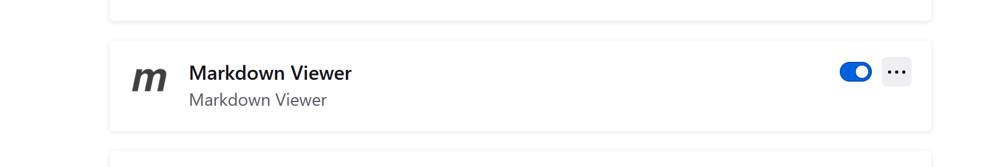

<!-- V markdowne je možné použiť aj CSS -->

<style>

/* 
Cislovanie kapitol pomocou CSS:

https://gist.github.com/patik/89ee6092c72a9e39950445c01598517a */

h1 { counter-reset: h2counter; }
h2 { counter-reset: h3counter; }
h3 { counter-reset: h4counter; }
h4 { counter-reset: h5counter; }
h5 { counter-reset: h6counter; }
h6 {}

h2:before {
    counter-increment: h2counter;
    content: counter(h2counter) ".\0000a0\0000a0";
}

h3:before {
    counter-increment: h3counter;
    content: counter(h2counter) "." counter(h3counter) ".\0000a0\0000a0";
}

h4:before {
    counter-increment: h4counter;
    content: counter(h2counter) "." counter(h3counter) "." counter(h4counter) ".\0000a0\0000a0";
}

h5:before {
    counter-increment: h5counter;
    content: counter(h2counter) "." counter(h3counter) "." counter(h4counter) "." counter(h5counter) ".\0000a0\0000a0";
}

h6:before {
    counter-increment: h6counter;
    content: counter(h2counter) "." counter(h3counter) "." counter(h4counter) "." counter(h5counter) "." counter(h6counter) ".\0000a0\0000a0";
}


/*
Centrovanie obrazkov
https://stackoverflow.com/questions/255170/markdown-and-image-alignment/43691462#43691462

https://stackoverflow.com/questions/12090472/how-do-i-center-an-image-in-the-readme-md-file-on-github
*/

img[src*='#left'] {
    float: left;
}
img[src*='#right'] {
    float: right;
}
img[src*='#center'] {
    display: block;
    margin: auto;
}


</style>

# Typografia webových stránok

Autor1, Autor2, Autor3

<div style="page-break-after: always;">
</div>

# Obsah

- [Typografia webových stránok](#typografia-webových-stránok)
- [Obsah](#obsah)
  - [Markdown flavors](#markdown-flavors)
  - [Markdown cheat sheet](#markdown-cheat-sheet)
  - [Odkazy](#odkazy)
  - [Nadpisy](#nadpisy)
    - [Nadpis 3 úrovne](#nadpis-3-úrovne)
      - [Nadpis 4 úrovne](#nadpis-4-úrovne)
    - [Nadpis 3 úrovne](#nadpis-3-úrovne-1)
  - [Unordered list](#unordered-list)
  - [Horizontal rule](#horizontal-rule)
  - [Tabuľka](#tabuľka)
  - [Príklad použitia kódu](#príklad-použitia-kódu)
  - [Príklad použitia obrázkov a centrovania](#príklad-použitia-obrázkov-a-centrovania)
  - [Príklad použitia HTML tagov](#príklad-použitia-html-tagov)
  - [Použitie vo Firefoxe](#použitie-vo-firefoxe)
  - [VS code pluginy](#vs-code-pluginy)
    - [VS code export do PDF](#vs-code-export-do-pdf)
    - [VS code preview](#vs-code-preview)

## Markdown flavors

Existujú rôzne verzie markdownu tzv. flavours, ktoré sa však líšia minimálne.
Koncovka súboru je md

https://gist.github.com/vimtaai/99f8c89e7d3d02a362117284684baa0f

https://github.com/commonmark/commonmark-spec/wiki/markdown-flavors

https://github.com/markdown/markdown.github.com/wiki/Implementations

## Markdown cheat sheet

## Odkazy

[Odkaz na markdown cheat sheet](https://www.markdownguide.org/cheat-sheet/)

## Nadpisy

### Nadpis 3 úrovne

#### Nadpis 4 úrovne

### Nadpis 3 úrovne

## Unordered list

- First item
- Second item
- Third item

## Horizontal rule

Text pred oddeľovacou čiarou

---

Text za oddeľovacou čiarou

## Tabuľka

| Syntax    | Description |
| --------- | ----------- |
| Header    | Title       |
| Paragraph | Text        |

## Príklad použitia kódu

HTML

```HTML
<a href="./dog.jpg">
```

C

```C
#include <stdio.h>
int main()
{
	// printf je funkcia ktora v tomto pripade berie jeden arugment a tym je retazec
    // retazec sa uzatvara do dvojitych uvodzoviek
    printf("Hello world");
    return 0;
}
```

Python

```Python
#!/usr/bin/python3
x=10
if 9 < x:
  print("9 je mensie ako x")
else:
  print("9 je vacsie ako x")
}
```

## Príklad použitia obrázkov a centrovania

text a obrázok je defaultne zarovnaný na ľavú stranu

</br>


<center>text a obrázok vycentrovany na stred</center>

<!-- príklad na použitie HTML tagov pre nový riadok -->

</br>


## Príklad použitia HTML tagov

<mark>what is DataBase</mark>

## Použitie vo Firefoxe

- súbor s koncovkou MD (markdwon) sa dá zobraziť aj vo webovom prehliadači. Treba však doinštalovať nasledujúci plugin: Markdown viewer



## VS code pluginy

Markdown sa píše v akomkoľvek textovom editore, je však fajn mať pluginy ktoré to uľahčujú. Posledný plugin je vypnutý


### VS code export do PDF

- stlačiť F1 alebo Ctrl+Shift+P
- napísať: markdown-pdf

### VS code preview


